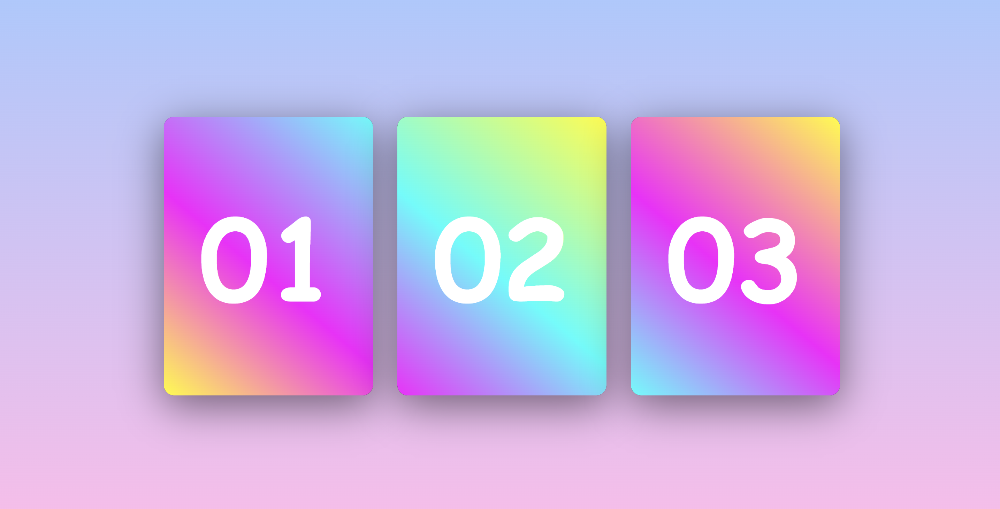

# ✨  HTML & CSS Card

This is a simple and responsive card UI component built using **HTML** and **CSS**. When you hover over each card, it smoothly reveals hidden content with animation.

## 🔍 Features

- Responsive card layout  
- Hover animation to reveal hidden content  
- Clean and modern UI  
- Pure HTML & CSS 

## 📸 Demo

 

## 🚀 Getting Started

📁 Folder Structure
```
hover-cards/
├── index.html
├── style.css
└── README.md
```


### 📦 Installation

1. Clone the repository:

```bash
git clone https://github.com/shelavalepallavi/css-cards.git
cd css-cards
```

Open index.html in your browser:


open index.html
Or use Live Server in VS Code for a better dev experience.

📱 Responsive Design
Cards are fully responsive and adapt well to different screen sizes. You can customize dimensions and styling easily in the CSS.

✨ Customization
Change card colors, fonts, and sizes in style.css

Add icons, images, or links to card content

Use :hover or @keyframes for more advanced effects
